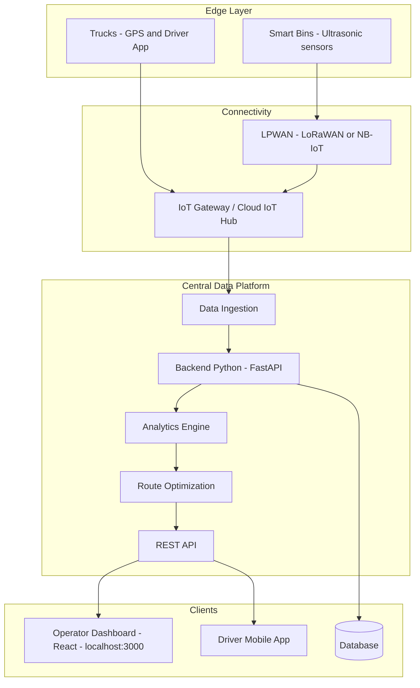
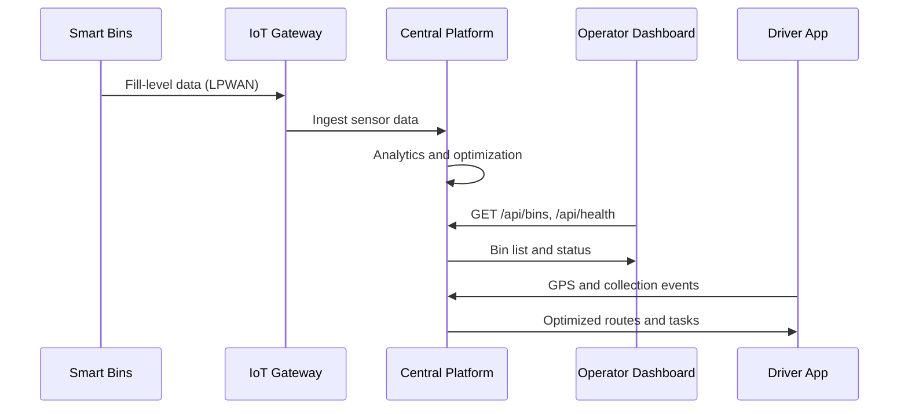
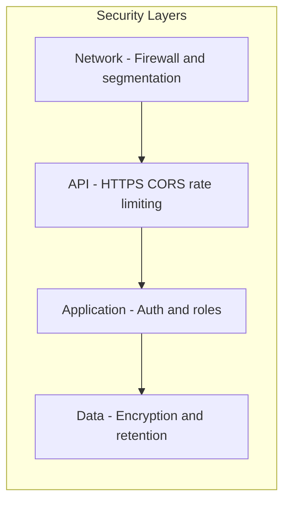
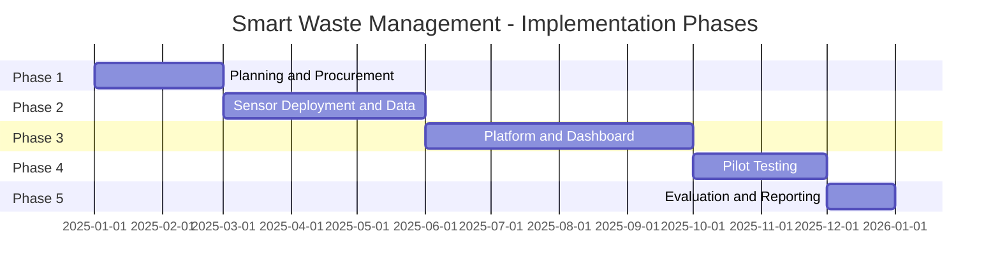

# Smart Waste Management System — Diagrams and Blocks for Word

Use this document to copy **blocks**, **tables**, and **diagram code** into your project documentation in Microsoft Word.

---

## How to Use in Word

| Content type | How to insert in Word |
|--------------|------------------------|
| **Tables and bullet lists** | Copy the block from this file and paste into Word. Adjust table borders if needed. |
| **ASCII diagrams** | Copy the diagram; in Word use a monospace font (e.g. Consolas, Courier New) and optionally add a border. |
| **Mermaid diagrams** | 1. Copy the Mermaid code. 2. Go to [mermaid.live](https://mermaid.live), paste the code, export as PNG or SVG. 3. Insert the image into Word. |

---

## 1. Executive Summary Block

**Title:** Executive Summary

The Smart Waste Management System optimizes garbage collection routes for trucks, reducing operational costs, fuel consumption, and environmental impact. It uses IoT sensors, real-time data analytics, and route optimization algorithms. The PUC University campus in Campinas, SP, is the pilot environment, with real-time bin fullness monitoring and a dashboard with red/green LED indicators.

**Goal:** To implement an intelligent waste management system that dynamically optimizes garbage collection routes based on real-time bin fullness data, enhancing efficiency, reducing costs, and improving environmental sustainability.

---

## 2. Problem Statement Block (Table for Word)

| Issue | Description |
|-------|-------------|
| Unnecessary trips | Trucks collect partially empty bins, wasting fuel, time, and labor. |
| Overflowing bins | Bins may overflow before scheduled collection, causing unsanitary conditions, odors, and pollution. |
| Suboptimal routes | Fixed routes ignore traffic, bin fullness, and vehicle availability, increasing travel time and cost. |
| Lack of visibility | No real-time data on bin status prevents proactive management. |

---

## 3. System Architecture Diagram (Mermaid)

Copy the code below into [mermaid.live](https://mermaid.live) and export as PNG/SVG for Word.



---

## 4. System Architecture Diagram (ASCII — paste into Word)

Use a monospace font (e.g. Consolas) in Word.

```
+------------------+     LPWAN (LoRaWAN/NB-IoT)     +----------------------+
| Smart Bins       | ----------------------------->| IoT Gateway /        |
| (Ultrasonic      |                               | Cloud IoT Hub        |
|  sensors)        |                               +----------+-----------+
+------------------+                                          |
                                                              v
+------------------+     GPS + Driver App          +----------------------+
| Trucks           | ----------------------------->| Central Data Platform|
+------------------+                                | (backend-python)     |
                                                   | - Ingestion          |
                                                   | - Analytics          |
                                                   | - Route optimization |
                                                   | - REST API           |
                                                   +----------+-----------+
                                                              |
         +------------------------+---------------------------+------------------------+
         |                        |                           |
         v                        v                           v
+----------------+       +----------------+           +----------------+
| Operator       |       | Node Services  |           | Database       |
| Dashboard      |<------| (gateway,      |           | (PostgreSQL /  |
| (frontend-     |       |  workers)      |           |  NoSQL)        |
|  react)         |       +----------------+           +----------------+
| localhost:3000  |
+----------------+
```

---

## 5. Data Flow Diagram (Mermaid)



---

## 6. Data Flow Block (Numbered list for Word)

1. **Sensors to platform:** Bin fill-level data is sent via LPWAN to an IoT gateway/cloud hub, then ingested by the backend.
2. **Backend to dashboard:** Dashboard calls REST API (e.g. GET /api/bins, GET /api/health); in development, Vite proxies /api to http://localhost:8000.
3. **Trucks to platform:** GPS and collection events from driver app to backend.
4. **Platform to drivers:** Optimized routes and tasks dispatched to driver app.
5. **Real-time (future):** Node gateway pushes live bin/truck updates to the dashboard via WebSockets.

---

## 7. Component Structure Block (Table for Word)

| Component | Path | Responsibility | Technologies |
|-----------|------|----------------|--------------|
| Backend | backend-python/ | Core API, data platform, route optimization, ingestion | Python 3.11+, FastAPI, Uvicorn, (future: PostgreSQL, Redis, OR-Tools) |
| Frontend | frontend-react/ | Operator dashboard: map, bin list, LED indicators, reports | React, TypeScript, Vite, Axios; dev server on port 3000 |
| Node services | node-services/ | Real-time gateway (WebSocket/MQTT), background workers | Node.js, (future: WebSocket, MQTT, job queues) |
| Documentation | docs/ | Requirements, architecture, API specs, governance | Markdown |
| Infrastructure | infra/ | Infrastructure as code, deployment | (Future: Terraform/Pulumi, CI/CD) |

---

## 8. Local Development Ports (Table for Word)

| Service | URL | Purpose |
|---------|-----|---------|
| Frontend | http://localhost:3000 | React dev server (Vite) |
| Backend API | http://localhost:8000 | FastAPI (Uvicorn) |
| API proxy | /api forwards to port 8000 | Vite proxy so frontend uses relative /api URLs |

---

## 9. Security Layers Diagram (Mermaid)



---

## 10. Security Principles Block (Bullet list for Word)

- **Least privilege:** Users and services have only the permissions required for their role.
- **Defense in depth:** Security at network, API, application, and data layers.
- **No secrets in code:** Credentials and keys in environment variables or secret managers.
- **Auditability:** Logging of access and sensitive operations (future).

---

## 11. Authentication and Roles (Table for Word)

| Aspect | Current (pilot) | Target |
|--------|------------------|--------|
| Operators (dashboard) | None | SSO or username/password; JWT or session-based auth |
| Drivers (mobile app) | None | Device or user auth; tokens for API access |
| API-to-API | None | API keys or service accounts for ingestion and internal services |
| Roles | Single user | Admin, Operator, Driver, Read-only |

**Authorization (target):** Operators view all bins and routes; drivers see only assigned routes and tasks; admins manage users and configuration.

---

## 12. Implementation Phases (Table for Word)

| Phase | Duration | Main activities |
|-------|----------|-----------------|
| 1. Planning and Procurement | 1–2 months | Campus mapping, bin locations, sensor/gateway selection and procurement, cloud setup. |
| 2. Sensor Deployment and Data Collection | 2–3 months | Install sensors, deploy LoRaWAN/NB-IoT gateways, establish baseline fill-level patterns. |
| 3. Platform and Dashboard Development | 3–4 months | Central platform, analytics, operator dashboard, route optimization module, API and proxy (e.g. localhost:3000 and backend). |
| 4. Pilot Testing and Optimization | 2 months | Deploy for campus trucks, monitor, tune algorithms, train operators and drivers. |
| 5. Evaluation and Reporting | 1 month | Evaluate outcomes (fuel, time, overflows), report results, recommend city-wide scaling. |

---

## 13. Implementation Timeline Diagram (Mermaid)



---

## 14. Project Team Roles (Table for Word)

| Role | Responsibility |
|------|----------------|
| Project Manager | Planning, timeline, stakeholder communication, risk and scope management. |
| IoT Hardware Engineers | Sensor selection, integration, gateway deployment, LPWAN design and maintenance. |
| Software Developers (Backend) | FastAPI services, ingestion, database, route optimization integration. |
| Software Developers (Frontend) | React dashboard, map, reports, and operator UX. |
| Software Developers (Mobile) | Driver application for routes, navigation, and collection confirmation. |
| Data Scientists / Route Optimization Specialists | VRP and ML models, tuning, and performance analysis. |
| Network Engineers | Campus and cloud network design, LoRaWAN/NB-IoT and gateway connectivity. |
| GIS Specialists | Campus mapping, bin and route geometry, map layers for dashboard. |
| PUC Campus Operations Liaison | Operational requirements, pilot coordination, and acceptance. |

---

## 15. System and Automation Agents (Table for Word)

| Agent | Description | Owner / Component |
|-------|-------------|-------------------|
| Sensor agent | Each bin sensor (or firmware) that collects fill level and sends data on a schedule or on change. | IoT / firmware |
| Ingestion agent | Backend process that receives sensor and GPS data, validates it, and persists or forwards to analytics. | backend-python (ingestion) |
| Optimization agent | Service that runs VRP or ML models on current bin and truck state and produces recommended routes. | backend-python (services) |
| Dispatch agent | Assigns routes and tasks to drivers and notifies the driver app. | backend-python or node-services (workers) |
| Real-time gateway | Pushes live bin/truck updates to the dashboard. | node-services (gateway) |
| Reporting agent | Generates scheduled or on-demand reports (efficiency, fill trends, KPIs). | backend-python or node-services (workers) |

---

## 16. Scope (PUC Campus Pilot) — Bullet list for Word

- Installation of smart sensors in designated garbage boxes across the campus.
- Development of a central data platform and user-friendly dashboard for monitoring and route planning.
- Integration of route optimization algorithms for campus waste collection vehicles.
- Real-time bin fullness status via visual indicators (red/green LEDs) on the dashboard.
- Analysis and reporting on route efficiency, fuel consumption, and collection frequency.

---

## 17. Expected Benefits Block (Bullet list for Word)

- **Cost reduction:** Savings in fuel, labor, and vehicle maintenance through optimized routes and fewer unnecessary trips.
- **Efficiency:** Up to approximately 30% reduction in collection time and better resource use.
- **Environmental impact:** Lower carbon emissions from fewer truck miles.
- **Sanitation:** Fewer overflowing bins; cleaner campus.
- **Decision making:** Real-time insights into waste patterns and collection performance.
- **Scalability:** Design allows extension to the city of Campinas or other areas.

---

## 18. Backend Internal Structure (Block for Word)

| Layer | Path | Purpose |
|-------|------|---------|
| Entry | app/main.py | FastAPI app factory, CORS, health and root endpoints, API router mounting. |
| API | app/api/ | REST route handlers (e.g. /api/bins; future: trucks, routes, reports). |
| Domain | app/core/ | Domain models (e.g. Bin; future: trucks, routes, collections). |
| Business logic | app/services/ | Route optimization, scheduling. |
| Ingestion | app/ingestion/ | Handlers for sensor and GPS data. |
| Config | app/config/ | Settings and environment. |
| Data | app/db/ | Database models and migrations (when introduced). |
| Tests | tests/ | Unit and integration tests. |

---

## 19. Frontend Internal Structure (Block for Word)

| Layer | Path | Purpose |
|-------|------|---------|
| Pages | src/pages/ | Top-level pages (Dashboard; future: Reports, Settings). |
| Components | src/components/ | Reusable UI (Header, BinList; future: Map, KPI cards). |
| Hooks | src/hooks/ | Data fetching (e.g. useBins). |
| Services | src/services/ | API client (Axios, base URL /api in development). |
| State | src/state/ | Global state (future, if needed). |
| Styles | src/styles/ | Global styles and theme. |

---

## 20. Dashboard LED Indicators (Block for Word)

| Indicator | Condition | Meaning |
|-----------|-----------|---------|
| Red LED | Bin fill level greater than or equal to 90% | Bin is full; prioritize collection. |
| Green LED | Bin fill level below 90% | Bin does not require immediate collection. |

---

*End of Diagrams and Blocks for Word. Copy any section into your Word document and, for Mermaid diagrams, use mermaid.live to generate images to insert.*
